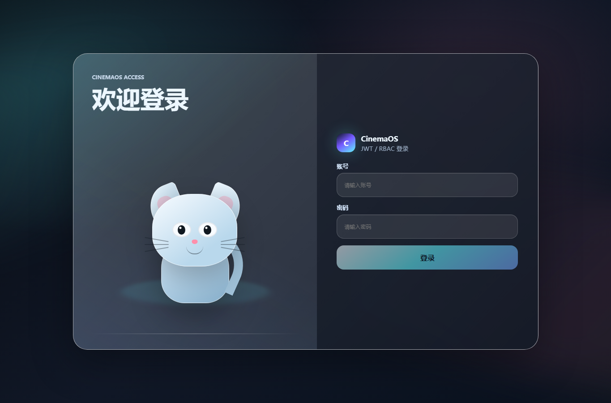
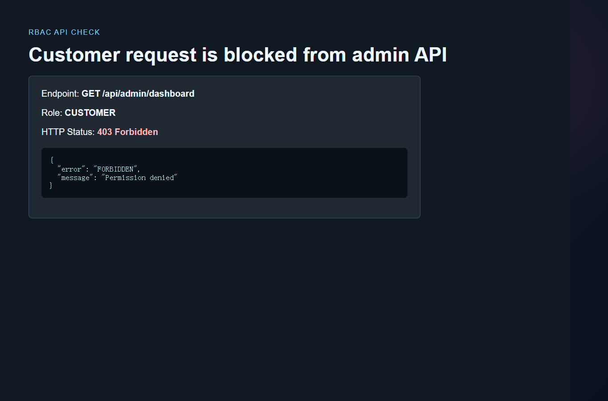

# 登录与权限模块实现报告

日期：2026-06-08

## 1. 实现结论

登录模块已实现账号密码认证、JWT、注销失效、RBAC 权限控制。业务页面不展示角色、JWT 过期时间和权限点，相关能力通过后端代码、接口返回和测试输出证明。

| 功能 | 状态 | 说明 |
| --- | --- | --- |
| 登录认证 | 已实现 | `POST /api/auth/login` 校验账号、密码和登录端类型 |
| JWT | 已实现 | 使用 HS256 签名，包含 `sub`、`role`、`permissions`、`iat`、`exp`、`jti` |
| 注销失效 | 已实现 | `POST /api/auth/logout` 将 JWT 的 `jti` 加入吊销表 |
| RBAC | 已实现 | `CUSTOMER` 与 `ADMIN` 映射到不同权限点 |
| 管理员接口保护 | 已实现 | 后台看板、调价、缓存管理、运维事件等接口需要管理员权限 |
| 普通用户接口保护 | 已实现 | 下单、我的订单、支付、取消订单等接口需要用户权限 |
| Spring Security | 已补充 | `spring-backend` 中保留认证策略模块 |
| Shiro | 已补充 | `spring-backend` 中保留角色权限映射模块 |

说明：主运行系统是 Node/Express，因此真实运行链路由 Express + JWT + RBAC 完成；Spring Security / Shiro 位于 `spring-backend`，用于课程架构设计与模块证明。

## 2. 关键代码摘录

### 2.1 JWT 签发与角色权限

位置：`src/auth.js`

```js
const ROLE_PERMISSIONS = Object.freeze({
  CUSTOMER: Object.freeze([
    "movie:read",
    "show:read",
    "order:create",
    "order:read:self",
    "order:pay:self",
    "order:cancel:self",
  ]),
  ADMIN: Object.freeze([
    "movie:read",
    "show:read",
    "admin:dashboard",
    "show:price:update",
    "order:read:any",
    "order:pay:any",
    "order:cancel:any",
    "cache:manage",
    "ops:view",
  ]),
});

function issueSession(user) {
  const now = Math.floor(Date.now() / 1000);
  const payload = {
    iss: JWT_ISSUER,
    sub: user.id,
    jti: crypto.randomUUID(),
    iat: now,
    exp: now + TOKEN_TTL_SECONDS,
    login: user.login,
    displayName: user.displayName,
    role: user.role,
    permissions: permissionsForRole(user.role),
  };
  return signJwt(payload);
}
```

### 2.2 RBAC 中间件

位置：`src/auth.js`

```js
function requirePermission(...permissions) {
  return requireAuth({ permissions: permissions.flat() });
}

function requireAuth(policy = {}) {
  return (req, res, next) => {
    const auth = req.get("authorization") || "";
    const token = auth.startsWith("Bearer ") ? auth.slice(7) : "";
    const session = getSession(token);
    if (!session) {
      res.status(401).json({ error: "UNAUTHENTICATED", message: "Please login first" });
      return;
    }

    if (normalized.permissions.length && !hasAnyPermission(session, normalized.permissions)) {
      res.status(403).json({ error: "FORBIDDEN", message: "Permission denied" });
      return;
    }

    req.user = session.user;
    req.auth = { claims: session.claims, permissions: session.permissions };
    req.token = token;
    next();
  };
}
```

### 2.3 管理员接口权限保护

位置：`src/server.js`

```js
app.get("/api/admin/dashboard", requirePermission("admin:dashboard"), async (_req, res, next) => {
  res.json(await buildAdminDashboard());
});

app.patch("/api/admin/shows/:showId/price", requirePermission("show:price:update"), async (req, res, next) => {
  const price = Number(req.body?.price);
  const show = updateShowPrice(req.params.showId, Math.round(price));
  res.json({ show: publicShow(item.movie, show) });
});

app.get("/api/ops/events", requirePermission("ops:view"), async (_req, res, next) => {
  res.json({ events: await store.recentEvents(20) });
});
```

## 3. 后端接口输出

执行后端验证脚本后，终端输出如下：

```text
[admin login] status = 200
[admin jwt] role = ADMIN
[admin jwt] permissions = movie:read, show:read, admin:dashboard, show:price:update, order:read:any, order:pay:any, order:cancel:any, cache:manage, ops:view
[admin jwt] has exp = true
[customer -> admin dashboard] status = 403
[customer -> admin dashboard] body = {"error":"FORBIDDEN","message":"Permission denied"}
```

这说明：

- 管理员登录成功后拿到 JWT。
- JWT 内含 `role=ADMIN`、权限点和过期时间。
- 普通用户携带自己的 token 访问管理员接口时，被 RBAC 拦截，返回 `403 Forbidden`。

## 4. 页面截图

### 4.1 登录页



### 4.2 普通用户访问管理员接口被拒绝



## 5. 测试结果

已执行：

```bash
npm test
```

关键输出：

```text
ok 1 - login issues jwt claims, rbac permissions, and logout revokes the token
ok 2 - customer must login before ordering, then can pay locked seats
ok 3 - customer cannot create one order with more than four seats
ok 4 - admin can view dashboard and update show price
ok 5 - movie search remains available for the customer side
ok 6 - movies list cache returns the full catalog on repeated requests
1..6
# tests 6
# pass 6
# fail 0
```

运行时说明：Redis 和 Elasticsearch 未启动时，系统会自动降级到内存模式，不影响登录、JWT 和 RBAC 验证。
